# Dify RAG 单个云实例部署文档 -- AMD CPU

## Dify简介
**Dify** 是一款开源的 **大型语言模型（LLM）应用开发平台**，旨在帮助用户快速构建、部署和管理基于 AI 的应用程序。它的核心特点包括 **低代码/可视化开发**，用户可以通过拖拽组件的方式设计 AI 工作流，无需深入编码即可创建聊天机器人、文本生成工具或复杂自动化任务。Dify 支持 **多模型集成**，兼容 OpenAI、Anthropic等主流 LLM，并能快速接入新模型，提供灵活的选择。此外，Dify 内置 **RAG（检索增强生成）引擎**，可结合外部知识库提升 AI 回答的准确性，适用于企业知识管理、智能客服等场景。  

Dify 的 **优点** 在于其 **易用性和高效性**，即使是 **非技术人员** 也能快速上手，同时提供企业级功能如 **权限管理、日志监控和 API 集成**，适合创业团队、企业及个人开发者。它的 **开源特性** 允许私有化部署，确保数据安全，并支持灵活的定制化需求。  

**主要用途** 包括：  
- **智能客服**：构建多轮对话机器人，提升服务效率。  
- **内容生成**：自动撰写文章、翻译或营销文案。  
- **企业知识库**：通过 RAG 技术实现精准问答。  
- **自动化流程**：如数据分析、邮件处理等复杂任务编排。  

Dify 通过 **一站式解决方案**，大幅降低了 AI 应用的开发门槛，加速从创意到落地的进程。

## RAG简介
**检索增强生成（RAG, Retrieval-Augmented Generation）** 是一种结合信息检索与大型语言模型（LLM）生成能力的技术，旨在解决传统大模型在专业知识、时效性和数据安全等方面的局限性。由于大模型的训练数据通常存在**知识局限性**（如无法覆盖专业领域或实时信息）和**幻觉问题**（可能生成不准确的回答），RAG通过引入外部知识库，使模型能够动态检索相关数据并生成更准确、可靠的回答。  

**RAG的核心流程** 可分为三个阶段：  
1. **数据准备**：将外部知识（如企业文档、数据库）进行文本分割、向量化（Embedding）并存储至向量数据库（如FAISS、Milvus）。  
2. **检索阶段**：用户提问时，系统将问题转化为向量，从数据库中检索最相关的文本片段。  
3. **生成阶段**：检索到的内容与用户问题结合，通过Prompt工程输入LLM，生成最终答案。  

**RAG的实际应用** 广泛覆盖多个领域：  
- **智能客服**：结合企业知识库提供精准回答，如法律咨询或产品支持。  
- **医疗与金融**：辅助医生检索最新研究，或帮助分析师整合市场数据生成报告。  
- **内容创作**：自动生成基于权威数据的文章或新闻摘要。  

RAG通过动态结合外部知识，显著提升了AI的可信度与实用性，成为企业部署生成式AI的重要方案。

## 计费说明 （place holder)

该应用在阿里云上的费用主要涉及：

- 所选CPU云服务器的规格
- 磁盘容量
- 公网带宽 计费方式：按量付费（小时）或包年包月 预估费用在创建实例时可实时看到。

## RAM账号所需权限（place holder)

|权限策略名称|备注|
|---|---|
|AliyunECSFullAccess|管理云服务器服务（ECS）的权限|
|AliyunVPCFullAccess|管理专有网络（VPC）的权限|
|AliyunROSFullAccess|管理资源编排服务（ROS）的权限|
|AliyunComputeNestUserFullAccess|管理计算巢服务（ComputeNest）的用户侧权限|

## 部署流程
1. 单击部署链接。根据界面提示实例选择并填写参数，可以看到对应询价明细，确认参数后点击下一步：确认订单。
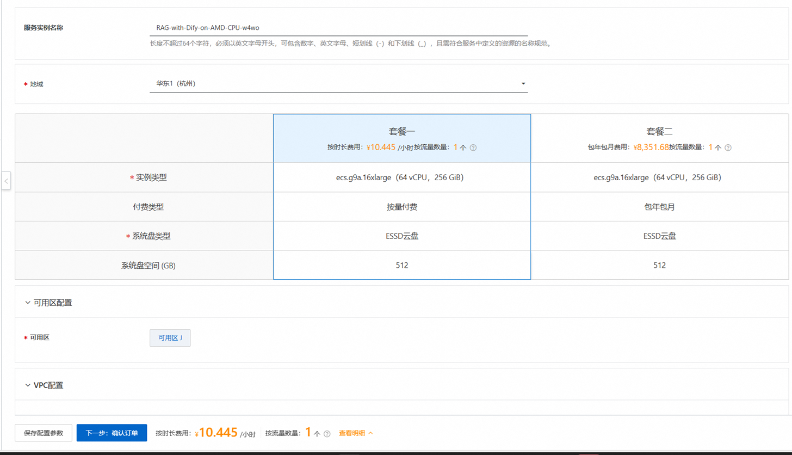
2. 创建VPC,填写用户名/密码，选择系统盘，确认订单完成后同意服务协议并点击立即创建。
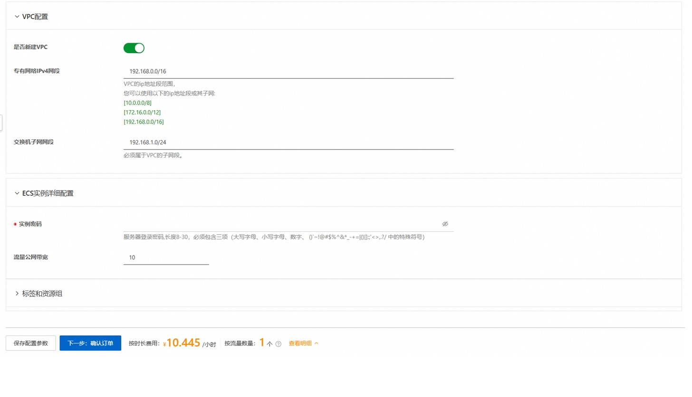
3. 等待部署完成后就可以开始使用服务，进入服务实例详情页，在资源栏中远程连接ECS
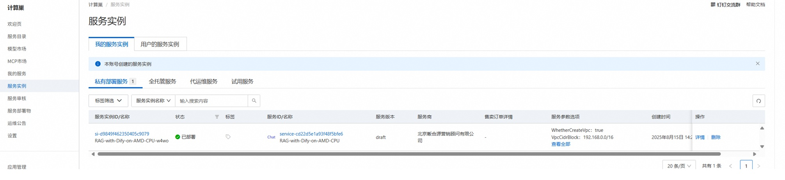
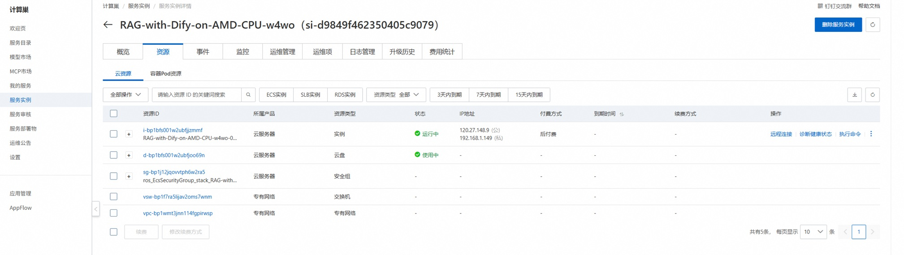
4. 启动服务
该部署流程已经预先设置了运行Dify的配置文件，下载了预设的LLM模型，并且提供了本地运行LLM的配置文件。普通用户只需一行命令即可启动所有服务。在终端中，进入`workspace/dify/docker`目录，运行以下命令。
```bash
./start.sh
```

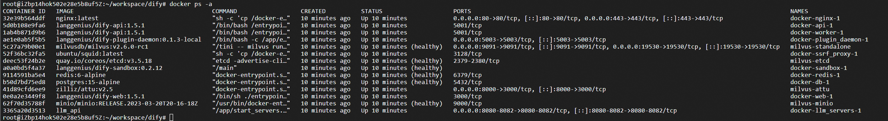
请确认上面的服务启动正常。

高级用户可以选择使用自己想要的LLM模型。LLM模型通过llama.cpp运行。用户需要下载模型的GGUF文件到`workspace/models`目录，然后修改`workspace/dify/docker/llm_api/env_setup.sh`文件中的模型名字，最后运行启动命令。

如果需要停止所有的dockers容器，在`workspace/dify/docker`目录下运行以下命令。
```bash
docker compose down
```

## 访问 Dify 网页界面
启动服务后，通过公网地址使用Dify， http://your-host-IP
该部署已经预设了管理员用户和密码。使用 demo@gmail.com 登录，密码是 "demo1234!"

## 在 Dify 中搭建 RAG 的分步说明

改部署已经设置了Dify使用的模型、创建了用于演示的知识库和聊天流程。用户登录后即可开始对话。

如果用户需要重新设置账户以及创建自己的知识库，请按照以下步骤操作。
#### 设置模型
进入 "Settings -> Model Provider"
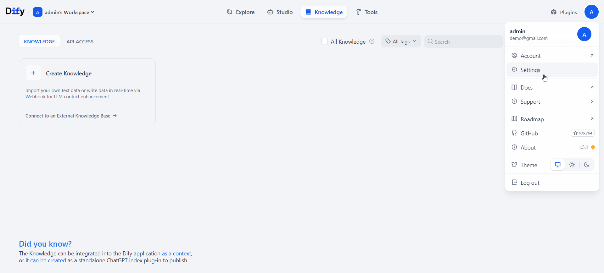
安装 OpenAI-API-compatible 插件
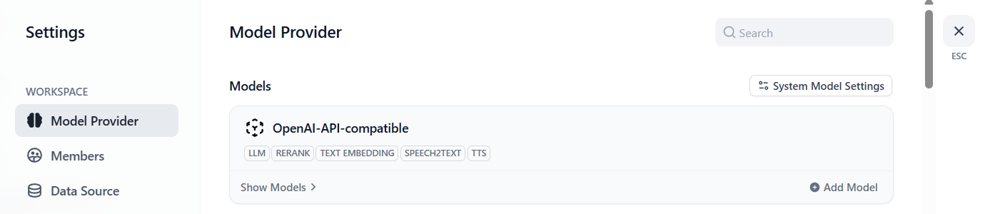

安装插件后，点击 "Add model"
对于 LLM，输入模型名称和 API URL。我们从端口 8080 提供模型服务。
API URL 是 http://host.docker.internal:8080/v1
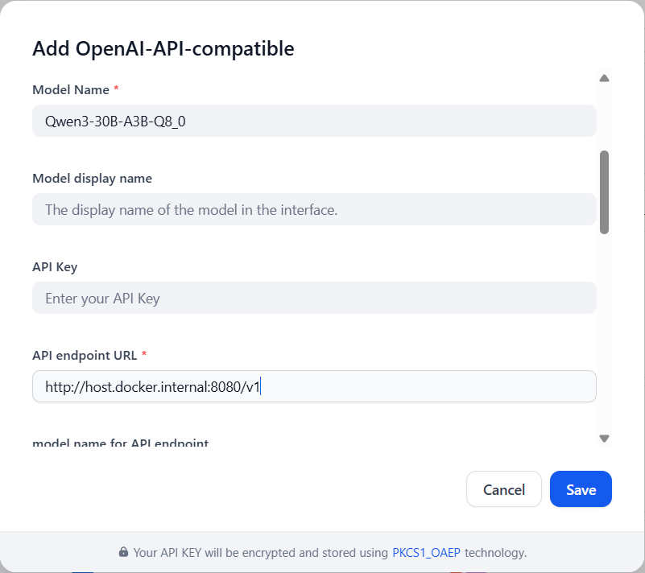
同样，设置嵌入和重排序模型。
对于嵌入模型，API URL 是 http://host.docker.internal:8081/v1
对于重排序模型，API URL 是 http://host.docker.internal:8082/v1

设置这些模型后，还要完成系统模型设置，并保存设置。
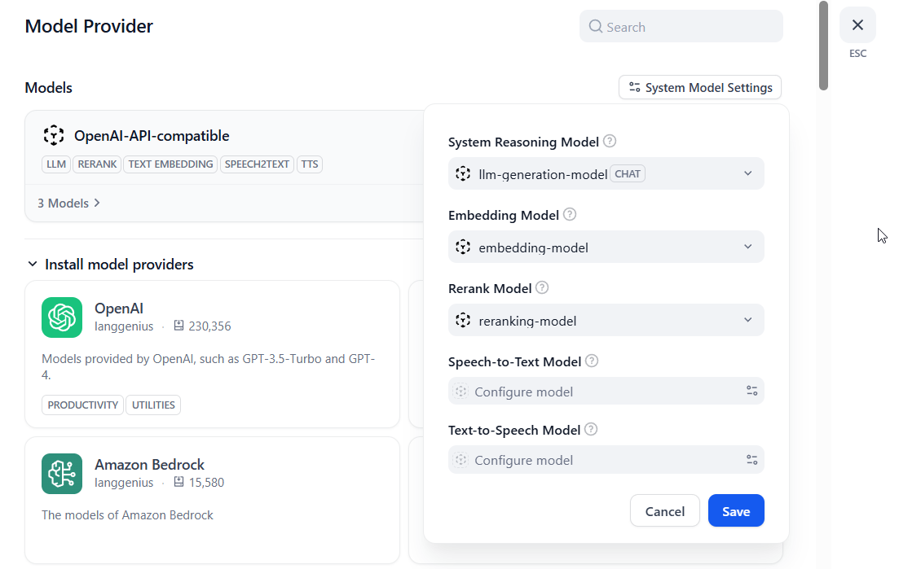

#### 创建知识库
点击 "Knowledge -> Create Knowledge -> upload file -> Next"，然后选择分块方法、嵌入模型和检索设置。

下面只是提供一个例子。这些参数需要根据用户自己的文档进行优化。
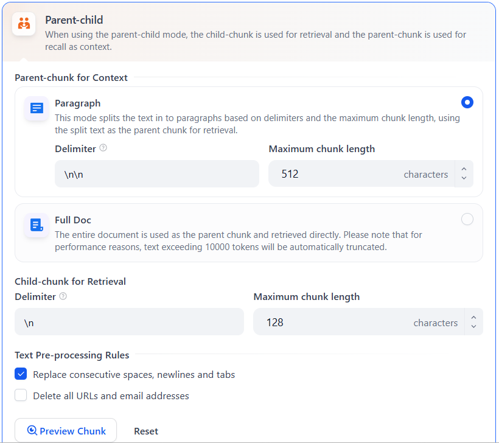
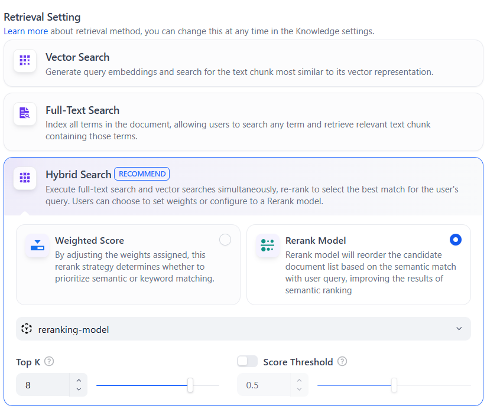
在该部署流程中，我们使用 Milvus 作为向量数据库。这里推荐使用混合搜索。

#### 创建聊天工具
点击 "Studio -> Chatflow -> create from blank"，给你的应用一个名称，然后点击 "create"
这就是一个简单的 RAG聊天机器人。
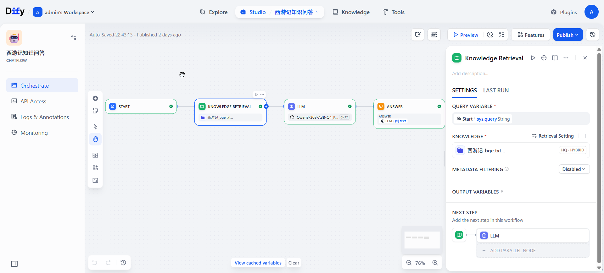

## 监控工具
#### LLM 日志
llama.cpp 运行日志位于 `volumes/llm_logs` 文件夹中。生成模型、嵌入模型和重排序模型分别生成自己的日志。性能指标可以在日志文件中查看。

#### Milvus 网页界面
这里的RAG使用Milvus 向量数据库。我们提供了一个网页界面工具来检查 milvus 向量数据库。URL 是 http://your-host-ip:8000。 确保在VM 实例中开放此端口。用户名是 "root"，密码是 "Milvus"。
